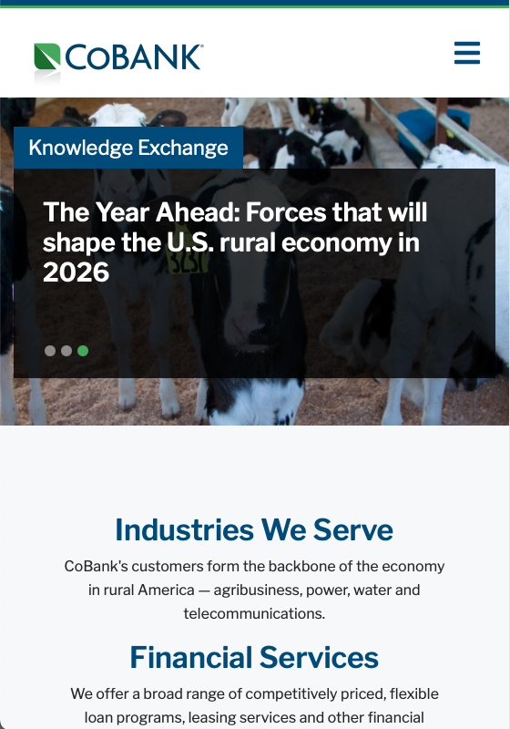
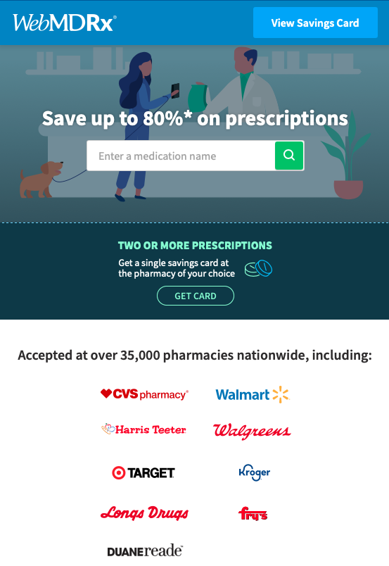
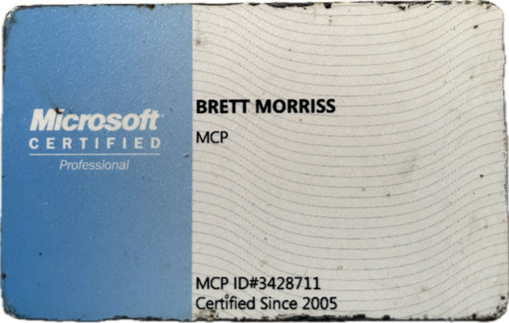
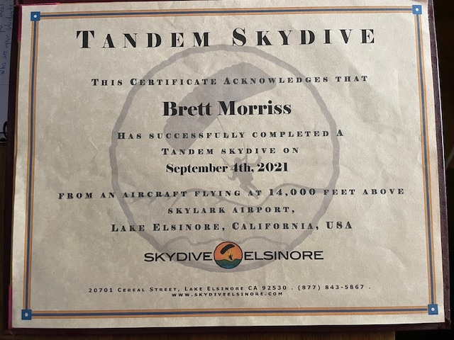
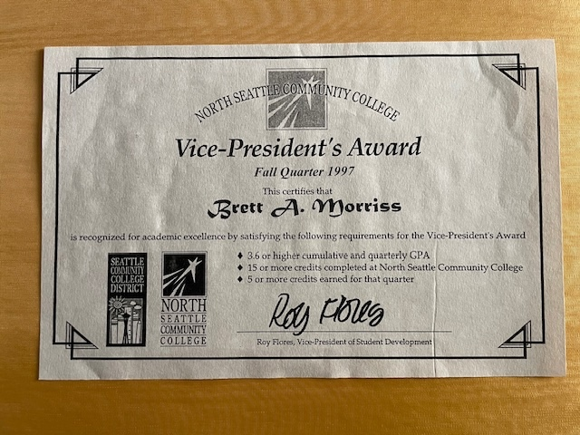
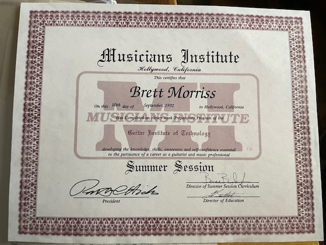

<h1>Hi there :call_me_hand: - I'm Brett Morriss :wave:</h1>

## Welcome to my GitHub home

- :hammer: I love building, and sharing how to create, great things
- :muscle: I have decades of experience working across evolving stacks, going back to the OSI model layers
- :telescope: I'm Currently focused on AI LLMs, Next.js v16, and React v19.2.x

## Skills & Tools

- **Frontend:** React, Next.js
- **Backend:** Node, Express, SQL
- **AI:** LLMs, OpenAI APIs, Agents, MCP, Cursor, CoPilot
- **DevOps:** Docker, CI/CD, AWS, Kubernetes, Terraform
- **Testing:** React Testing Library, Jest, Vitest, Playwright, Cypress
- **Languages:** JavaScript, TypeScript, Python, Java
- **Design:** Figma, UX Principles, Storybook

## Projects

| :fire:     | :mega:                                                                                                                                     | :construction_worker:                                                                                                                            |
| ---------- | ------------------------------------------------------------------------------------------------------------------------------------------ | ------------------------------------------------------------------------------------------------------------------------------------------------ |
| :bank:     | <kbd><a href="https://www.cobank.com"><a></kbd>                   | Made major contributions towards the creation and launching of CoBank's banking portal, as a Scaled Agile Framework (SAFe) team leader           |
| :apple:    | <kbd></kbd> | Created scalable, themed React NativeBase community forum, launched in under 8 months, enhancing community engagement with feature-rich tools    |
| :hospital: | <kbd></kbd>                        | Rearchitected and enhanced this vital resource for WebMD from Angular to Vue, addding enhancements like SEO and auto regeneration of the sitemap |

## Hobbies and Activities

- ocean, surfing :ocean: :turtle: :tropical_fish: :octopus: :surfer:
- music :musical_score: :guitar: :microphone:
- photography :camera:
- hiking, backpacking :sunrise_over_mountains:
- running, biking, soccer/futbol: :runner: :bike: :soccer:
- home renovation :derelict_house: :arrow_right: :house_with_garden:
- finance, markets :chart_with_upwards_trend:
- games, puzzles: :video_game: :game_die:
- volunteering:
  - Meals on Wheels: delivering nutritious meals to homebound seniors :stew: :bread:
  - Mālama Māla: cleanup and conservation :palm_tree:

## Certifications et al.

<kbd></kbd>

### Microsoft Certified Professional (MSP)

2005 was an incredible year, one of my favorite gigs! As a contractor I became the primary engineer on the Microsoft Sales, Marketing, Services Group at the Redmond main campus.
I became the owner of the New Hire Advisor SharePoint Team Site, as well as helping the Sharepoint team.  
:muscle: While there, I developed a way to build FrontPage sites dynamically saving hours of dev time. And, since I was already writing core C# code for Sharepoint I decided to get MCP certified.

---

<kbd></kbd>

### Skydiving

I occasionally like to jump out of a perfectly good airplane :small_airplane: :parachute:

---

<kbd></kbd>

### Computer Science Learning

:brain: Academic award while learning about operating systems and programming languages. I attended both North Seattle College and Bellevue College

---

<kbd></kbd>

### Premiere Rock and Roll training/proving grounds

:guitar: Woodshedding days for lead and rythm guitar.
Ask me about my bands: _Vegetable Soup_ while at GIT in Hollywood, _Tribal Soul_ and _Thick_ while playing the Seattle scene
